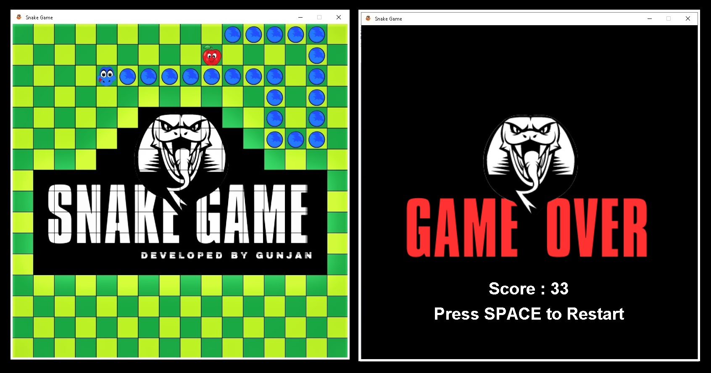

[![Contributors][contributors-shield]][contributors-url]
[![Forks][forks-shield]][forks-url]
[![Stargazers][stars-shield]][stars-url]
[![Issues][issues-shield]][issues-url]
[![LinkedIn][linkedin-shield]][linkedin-url]
 
 
<!-- PROJECT LOGO -->

  

  <h3 align="center">Java Snake Game</h3>
  
  

    <a href="https://github.com/Gunjan-dhande/SnakeGame"><strong>Explore the repository </strong></a> 
    <a href="https://youtu.be/p5yNgzAFZGc"><strong> Snake Game Play Video Link </strong></a>
     
     
    <a href="https://github.com/Gunjan-dhande/SnakeGame">View Code</a>
    ·
    <a href="https://github.com/Gunjan-dhande/SnakeGame/issues">Report Bug</a>
    ·
    <a href="https://github.com/Gunjan-dhande/SnakeGame/issues">Request Feature</a>
  

<!-- TABLE OF CONTENTS -->

  
Table of Contents

  <ol>
    <li><a href="#about-the-project">About The Project</a></li>
    <li><a href="#usage">Usage</a></li>
    <li><a href="#instructions">Instructions</a></li>
    <li><a href="#contributing">Contributing</a></li>
    <li><a href="#license">License</a></li>
    <li><a href="#contact">Contact</a></li>
  </ol>

<!-- ABOUT THE PROJECT -->
## About The Project

<b>Java Snake Game</b> is a simple snake game coded in Java.
The Java Snake Game is a classic arcade-style game where the player controls
 a snake and tries to eat food while avoiding collisions with walls and the snake's 
 own tail. It is implemented using Java programming language and provides an 
 interactive and enjoyable gaming experience.Bug reports, suggestions and tips 
are always welcome!
You can help keep the jSnake hanging. Star this repository! 🌟

### Features

* Snake Control: The player can control the snake's movement using arrow keys (up, down, left, right) 
* Food Generation: Randomly positioned food appears on the game board, which the snake needs to eat to grow in size.
* Score Tracking: The game keeps track of the player's score, which increases each time the snake eats food.
* Game Over: The game ends if the snake collides with the walls or its own tail. The player can then see their final score and have the option to restart the game.
* Speed Adjustment: The game's speed gradually increases as the snake grows longer, providing an additional challenge for the player.

### Built With

* [Java](https://en.wikipedia.org/wiki/Java_(programming_language))
* [Array](https://en.wikipedia.org/wiki/Array_(data_structure))
* [Loops](https://en.wikipedia.org/wiki/LOOP_(programming_language))
* [Java Swing](https://en.wikipedia.org/wiki/Swing_(Java))
* [AWT](https://en.wikipedia.org/wiki/Abstract_Window_Toolkit)

<!-- USAGE -->
## Usage
1. Make sure you have `javac` and `java` executables installed and configured
2. Download the code, then compile and run Java Snake Game typing `javac Javac SnakeGame.java && java SnakeGame`
3. Click Yes if prompted by UAC (Administrator priviliges are not required by default)
4. Just move with arrow keys and play the game✨
5. Once done `exit` to close game.

<!-- INTRUCTIONS -->
## Instructions

1. Use the arrow keys to control the snake's movement.
2. Eat food to increase your score and make the snake grow.
3. Avoid colliding with walls or the snake's own tail, as it will result in game over.
4. Try to achieve the highest score possible and compete with your friends.

See the [open issues](https://github.com/Gunjan-dhande/SnakeGame/issues) for a list of proposed features (and known issues).

<!-- CONTRIBUTING -->
## Contributing

If you would like to contribute to the game, feel free to the repository, 
make your changes, and submit a pull request with your enhancements or bug 
fixes. Contributions are what make the open source community such an amazing 
place to be learn, inspire, and create. Any contributions you make are 
**greatly appreciated**.

1. Create your Feature Branch (`git checkout -b feature/AmazingFeature`)
2. Commit your Changes (`git commit -m 'Add some AmazingFeature'`)
3. Push to the Branch (`git push origin feature/AmazingFeature`)
4. Open a Pull Request

<!-- LICENSE -->
## License

This Snake game is released under the [IntelliJ IDEA 2023.1.1 (Community Edition)]. See the `LICENSE` file for more information.
Enjoy playing the Java Snake Game and have fun!

<!-- CONTACT -->
## Contact

Project Link: [https://github.com/Gunjan-dhande/SnakeGame](https://github.com/Gunjan-dhande/SnakeGame)

<!-- MARKDOWN LINKS & IMAGES -->
<!-- https://www.markdownguide.org/basic-syntax/#reference-style-links -->
[contributors-shield]: https://img.shields.io/github/contributors/jihedkdiss/jSnake.svg?style=for-the-badge
[contributors-url]: https://github.com/Gunjan-dhande/SnakeGame/graphs/contributors
[forks-shield]: https://img.shields.io/github/forks/jihedkdiss/jSnake.svg?style=for-the-badge
[forks-url]: https://github.com/Gunjan-dhande/SnakeGame/network/members
[stars-shield]: https://img.shields.io/github/stars/jihedkdiss/jSnake.svg?style=for-the-badge
[stars-url]: https://github.com/Gunjan-dhande/SnakeGame/stargazers
[issues-shield]: https://img.shields.io/github/issues/jihedkdiss/jSnake.svg?style=for-the-badge
[issues-url]: https://github.com/Gunjan-dhande/SnakeGame/issues
[linkedin-shield]: https://img.shields.io/badge/-LinkedIn-black.svg?style=for-the-badge&logo=linkedin&colorB=555
[linkedin-url]: https://www.linkedin.com/in/gunjan-dhande
